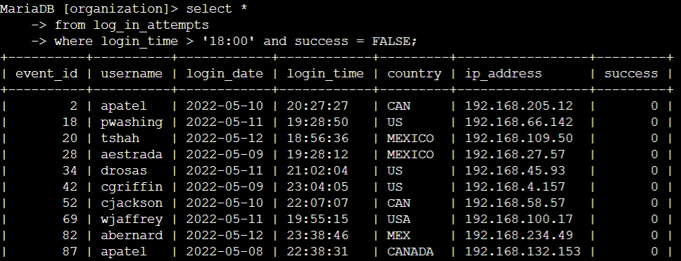
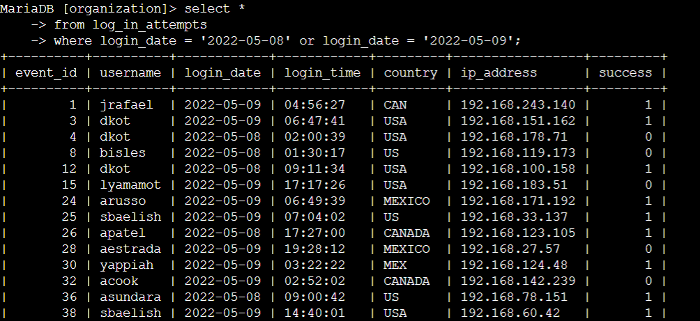
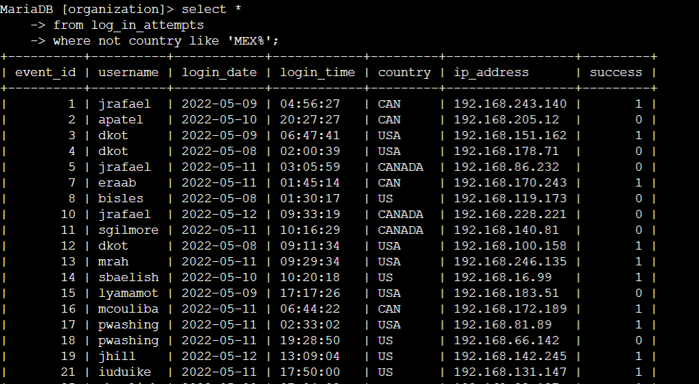
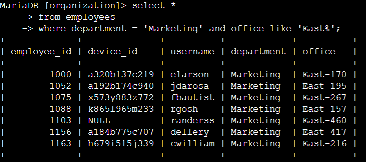
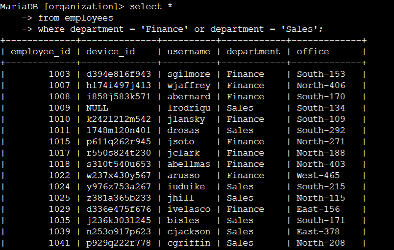
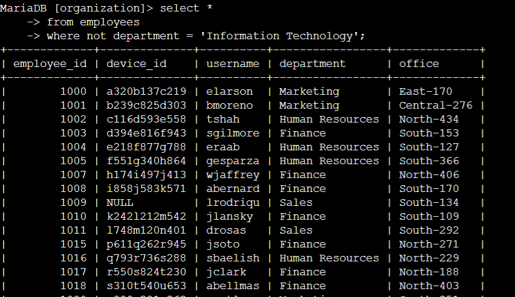

> # Apply filters to SQL queries

### Project description

As a security analyst, my job is to examine security issues and keep track of securing the system. My organization recently found out there is a potential security issue concerning login attempts and employee machines. I was able to complete these tasks using SQL filters and the steps are as follows.

### Retrieve after hours failed login attempts

First of all, the one thing of concern for the organization is malicious login attempts outside of working hours because one potential incident occurred during these hours. This is how I investigate login attempts after working hours using SQL filter.

I retrieved all the unsuccessful login attempts using `select *` from the table `log_in_attempts`. Afterwards, two conditions are applied using a `where` clause, one states after working hours by writing `login_time > ‘18:00’`, with `AND` operator, whereas using a boolean value `FALSE` to explore unsuccessful attempts.

### Retrieve login attempts on specific dates

A suspicious login attempt occurred on `‘2022-05-09’`. Our security team wants to inspect all the login attempts that happened on that day and the day before `‘2022-05-08’`. Here is how I used SQL to retrieve these login attempts.

I used `select *` from log_in_attempts to view all the record in the table. Then, a filter is applied by using `where` and two conditions are given with an `OR` clause. As we just want to see every login attempts on two dates, `login_date = ‘2022-05-08’` and `login_date = ‘2022-05-09’` are used with the clause to act as a filter.

### Retrieve login attempts outside of Mexico

After investigating the login attempts, my team suspects the incident could have happened outside of the `Mexico` region. Hence, I searched for all the login attempts except `Mexico`.

This time, due to both acronym and full name, an argument with a wildcard is used in the SQL. In `‘MEX%’`, the symbol `‘%’` is used as a wild card in SQL, which means it includes any letter that comes after the word `‘MEX’`. The clause `‘LIKE’` is used instead of `‘=’` in wildcard filters. With a `NOT` operator, which excludes the argument value `‘MEX%’`, I was able to find all the login attempts that is outside of `MEXICO`.

### Retrieve employees in Marketing

My team is updating employee machines and we want to gather information about the `‘Marketing’` department, whose work buildings are in the `East` offices. Here is the SQL statement that I use to retrieve all their information and machines.

`select *` is used to retrieve all the information from the `employees` table. A wildcard statement was applied with `department = ‘Marketing’` filter as there are numerous offices in the `East` building. 

### Retrieve employees in Finance or Sales

Moreover, my team wants to update other employee computers in `Finance` and `Sales` departments. Following is the SQL statement that I used.

As usual, I retrieved all the records in the `employees` tables with a filter using an `OR` clause. It shows all the employees with their machine IDs in the `Finance` and `Sales` department.

### Retrieve all employees not in IT

A critical update for the machines that fixes the vulnerability in the previous version has come out recently. The security team wants to find information about all the other departments as we have updated all the machines in the `Information Technology` department. Below is the SQL statement to view all the machines of employees except IT department.

A `NOT` clause is used for extracting all the information except the `Information Technology` department from `employees` table.

### Summary

This document outlines how SQL filters are used to investigate security-related issues and retrieve specific employee information. I have achieved security related operations such as filtering through `log_in_attempts` table based on time, date, and location, as well as retrieving employee data by department from `employees` table. Various SQL clauses such as `WHERE`, `AND`, `OR`, `LIKE`, and `NOT` are demonstrated to achieve these filtering objectives.