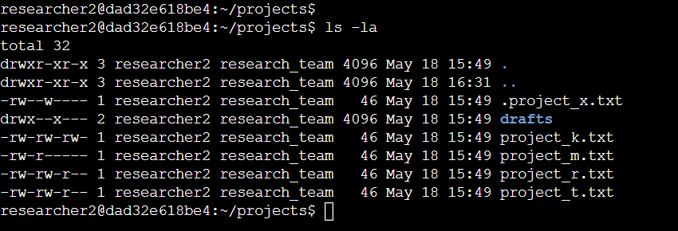
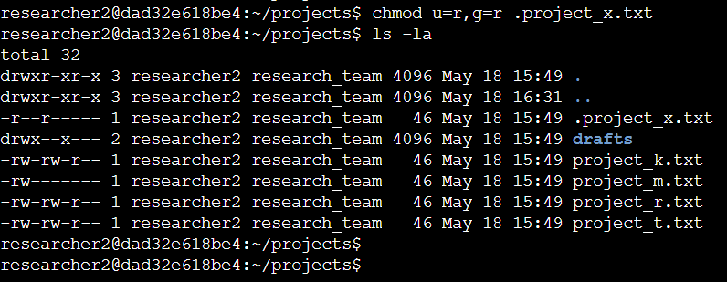
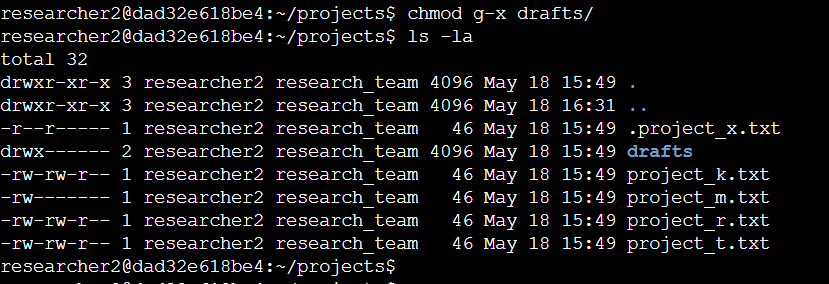

> # File Permissions in Linux

### Project description

The research team at my organization needs to update file permissions of specific files in the `projects` directory. Current file permissions in the directory are against the organization’s intended access and authorization policy. In order to keep aligned with the policy, I will update specific permissions of particular files as follows:

### Check file and directory details

Before starting anything, I need to review all the permission details of the files in the `projects` directory. Therefore, I can update specific permissions.

In order to review the permissions, I used `ls -la` command to show all the files with permissions including hidden files that starts with `.` or `..` 
In the screenshot, I see 3 hidden files that contains one project file, one directory and 4 project files. In these lines, we can see permissions for the user, group and other users written as example: `drwxr-xr-x`. 

### Describe the permissions string

The permission string contains 10 characters. Each letter represents file type, user, group and other users permission. One of each character is defined into the following:

1st character: This letter represents the file type, `d` for the directory and `-` for the ordinary file.

2nd-4th character: These three letters represent permission for the user, which in this directory will be `researcher2`. The first place is read permission and if the user has that permission, it will be denoted with `r` and `-` if the user does not have access. The second place is write permission and it will indicate `w` if the user have write permission and `-` if the user does not have. The third place is execute permission and is represented with `x` if the permission is granted and `-` if it is not.

5th-7th character: These letters represent permission for the group, which is `research_team` in this folder. Read, write, and execute permissions are also defined as above.

8th-10th character: Other user permissions can be seen in these characters. Permissions are assigned as `r`, `w`, `x` or `-` as explained.

### Change file permissions

Among these files, 2 of them have incorrect permission that needs to be fixed. Due to the researcher team’s policy, the users should not have write permission on the `project_k.txt` file and group users should not have read permission on the `project_m.txt` file. I can simply correct this by writing two command lines as below.

Let’s review these commands. In the first line, the command `chmod` enables modification of permissions on specific files. After that, `o` defines other user permissions, `-` means denying access, and `w` means write permissions. Later is the file name. The command means denying write permission to other users without denying read access.
Similarly, on the second line, chmod will fix the permission. Following that, `g` stands for group users, `-` stands for denying to read permission which is `r`.

### Change file permissions on a hidden file

One of the hidden files also has incorrect permissions, which the user and group should only have read access. Here is the command to fix that permission.

`chmod` is used to change permissions. Unlike `-` on the previous commands, `=` reassigns the whole permission and sets only what is included in the command. After running the command, read permission is only remained for user and group user.

### Change directory permissions

The directory `draft` permits group users to execute. This is not in the policy of the research team and can be fixed with the chmod command as usual.

### Summary

Permissions are updated to be aligned with the team’s policy and users no longer have incorrect access to the files and directories. The command `chmod` comes in handy when it comes to modifying permissions for different users. It is important to review all the permissions before and after modifying using `ls -la` command. 