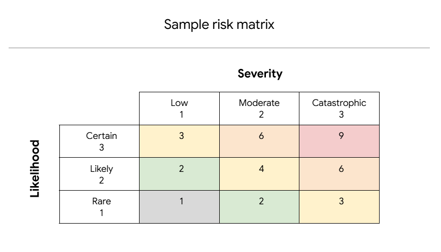

> # Risk Register

### Scenario

I've joined a new cybersecurity team at a commercial bank. The team is conducting a risk assessment of the bank's current operational environment. As part of the assessment, they are creating a risk register to help them focus on securing the most vulnerable risks.

A risk register is a central record of potential risks to an organization's assets, information systems, and data. Security teams commonly use risk registers when conducting a risk assessment.

My supervisor asks you to evaluate a set of risks that the cybersecurity team has recorded in the risk register. For each risk, I will first determine how likely that risk is to occur. Then, I will determine how severely that risk may impact the bank. Finally, I will calculate a score for the severity of that risk. I will then compare scores across all risks so my team can determine how to prioritize their attention for each risk.

### Operational environment:

The bank is located in a coastal area with low crime rates. Many people and systems handle the bank's data—100 on-premise employees and 20 remote employees. The customer base of the bank includes 2,000 individual accounts and 200 commercial accounts. The bank's services are marketed by a professional sports team and ten local businesses in the community. There are strict financial regulations that require the bank to secure their data and funds, like having enough cash available each day to meet Federal Reserve requirements.

| Asset | Risk(s) | Description | Likelihood | Severity | Priority |
| .... | .... | .... | .... | .... | .... |
| Funds | Business email compromise | An employee is tricked into sharing confidential information. | 2 | 3 | 6 |
| Funds | Compromised user database | Customer data is poorly encrypted. | 1 | 3 | 3 |
| Funds | Financial records leak | A database server of backed up data is publicly accessible. | 3 | 3 | 9 |
| Funds | Theft | The bank's safe is left unlocked. | 1 | 3 | 3 |
| Funds | Supply chain disruption | Delivery delays due to natural disasters. | 1 | 2 | 2 |
| Notes | Having several customers and remote employees increases the risk of business email compromise and financial records leaking. Moreover, due to having a strict regulation of handling the data and funds, and low crime rates of the local area,  these facts are considered to be low priorities. |

**Asset - Funds:**

Business email compromise (Risk): An employee is tricked into sharing confidential information.  
Likelihood: 2  
Severity: 3  
Priority: 6

Compromised user database (Risk): Customer data is poorly encrypted.  
Likelihood: 2  
Severity: 3  
Priority: 6

Business Financial records leak (Risk): A database server of backed up data is publicly accessible.  
Likelihood: 3  
Severity: 3  
Priority: 9

Theft (Risk): The bank's safe is left unlocked.  
Likelihood: 1  
Severity: 3  
Priority: 3

Supply chain disruption (Risk): Supply chain disruption | Delivery delays due to natural disasters.  
Likelihood: 1  
Severity: 2  
Priority: 2

**Note**  
Having several customers and remote employees increases the risk of business email compromise and financial records leaking. Moreover, due to having a strict regulation of handling the data and funds, and low crime rates of the local area,  these facts are considered to be low priorities.

**Asset:** The asset at risk of being harmed, damaged, or stolen.
**Risk(s):** A potential risk to the organization's information systems and data.
**Description:** A vulnerability that might lead to a security incident.
**Likelihood:** Score from 1-3 of the chances of a vulnerability being exploited. A 1 means there's a low likelihood, a 2 means there's a moderate likelihood, and a 3 means there's a high likelihood.
**Severity:** Score from 1-3 of the potential damage the threat would cause to the business. A 1 means a low severity impact, a 2 is a moderate severity impact, and a 3 is a high severity impact.
**Priority:** How quickly a risk should be addressed to avoid the potential incident. Use the following formula to calculate the overall score: **Likelihood x Impact Severity = Risk**

