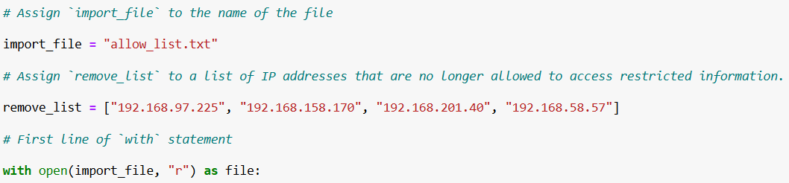
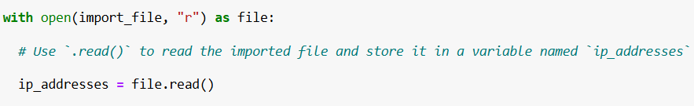
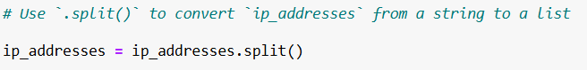
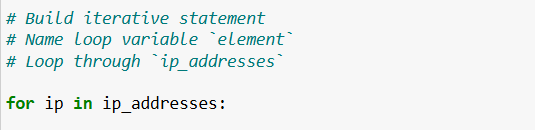
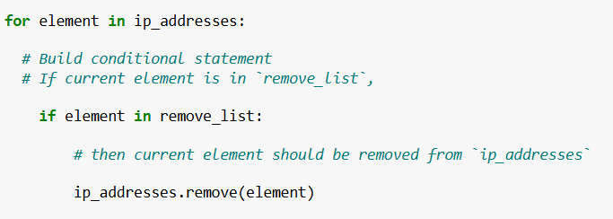
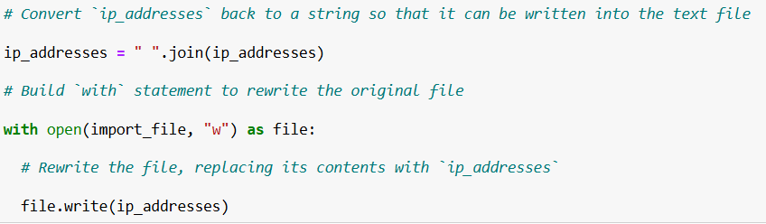

> # Algorithm for file updates in Python

### Project Description

My organization needs regular updates for a file that contains an access list for restricted content based on IP address. I will explore the list of IP addresses and remove those who no longer have access. I will do this with parsing a text file in Python.

### Open the file that contains the allow list

Firstly, I will import and open the file with Python code and create a list of unauthorized IP addresses to remove. I assign the file to a variable called `import_file`, along with `=` sign, which means assign `allow_list.txt` file to the variable. Then, I created a list variable `remove_list` with the IPs of employees whom I have to remove from the allow list. In order to open the file in Python, I use a Python statement `open(import_file, “r”) as file:`, which means open the file that is assigned to the variable to read. `“r”` stands for read mode, where `as file` accepts the objects returned by the `open file` function. `with` statement ensures that the file is closed properly after the function is executed.

### Read the file contents

After opening the file, I instructed the program to read it. I used `.read()` function to read all the contents in the `file` variable and then assigned it to `ip_addresses` variable.

### Convert the string into a list

The opened file is stored in a variable, which is a string data type. Since strings are immutable, I will convert it into a list type in order to check and remove unauthorized IP addresses. `.split()` function takes the value at each whitespace character and turns it into a list of string values.

### Iterate through the remove list

Now I got the list of IP addresses that need to be examined. I will go through each value in the `ip_addresses` to find out if there are IP addresses that are not allowed. I use a `for` loop and `in` statement to take out each value in the list at a time.

### Remove IP addresses that are on the remove list

I used `if` conditional statement to remove the IP addresses that are not allowed. Similarly, `if… in` statement take out each value from the `remove_list` and check with the element from `ip_addresses`. If there is an IP address that is in both lists, I remove that from the allow list using `ip_addresses.remove(element)`. The function `.reomve(element)` erases the specific element from the list variable.

### Update the file with the revised list of IP addresses 

After removing the unauthorized IP addresses from the allow list, I will revert the list into string data type again using `.join()` method. Thereafter, I will update the text file with a string that only contains allowed IP addresses. `“ “.join(ip_addresses)` join each element in the list with a whitespace and convert it into a string data type. `“w”` in `with open(import_file, “w”) as file:` stands for write mode, which rewrites a whole file after opening it. `file.write(ip_addressses)` rewrites the file and replace the content with value in `ip_addresses`.

### Summary

In this activity, I accomplished updating a file with by removing all the restricted IP addresses and allowing IP addresses that my organization needs. I wrote an algorithm of Python code to achieve my organization’s security requirements. To summarize this, I imported a text file and assigned it to a string type variable. Then I converted the string into a list for further processing. I iterated the list and checked if there is any IP address that is the same in the remove_list. After removing the invalid IP addresses, I reverted the list into a string and updated the file. All these processes are done within a small Python algorithm.